# Mackie App

# NB : This Application will be soon be updated with latest frameworks in Android

Mackie App is a music application that display a list of trending artist song and also a list of recommended songs to users.

_This is a custom application built and reviewed by Udacity Android Nanodegree Programme expert._

Mackie Application is under development.
_Note: Mackie Application is built only for learning and sharing lastest android development_

## Feature
* Kotlin Coroutine for async operations
* liveData an observable data holder class for lifecycle-aware task
* Dagger Hilt for dependency injection
* Databinding to bind UI layout to data model
* Retrofit library to had interaction with external api
* Room libray for local caching of data
* Shared preference for user session storage
* Custom firebase authentication 
* Glide an image loader library for imaging loading optimisation
* Camera hardware integration

## Get Started
**As this is an android project, you will need an android device to run the application**
_Instruction to run the project_
* Download and install lastest android studio on your device.
    - [Here](https://developer.android.com/studio) is the link to download the lastest version of android studio
* Clone the project repository by running the following command line on a terminal

    ```
    git clone https://github.com/Ayodeji97/Mackie.git
    
    ```
    
* Open project in android studio by clicking of File -> New -> Import project and choose the downloaded project
* You will need an Api Key to run the app
    - Get an api key from [this](https://rapidapi.com/apidojo/api/shazam/) link
* Store you api key in `gradle.properties` file
* Run the app

## Libraries
* [Kotlin Coroutine](https://developer.android.com/kotlin/coroutines)
* [Room Database](https://developer.android.com/topic/libraries/architecture/room)
* [LiveData](https://developer.android.com/topic/libraries/architecture/livedata)
* [Retrofit 2](https://github.com/square/retrofit)
* [DataBinding](https://developer.android.com/topic/libraries/data-binding)
* [ViewMOdel](https://developer.android.com/topic/libraries/architecture/viewmodel)
* [Gson](https://github.com/google/gson)
* [Glide](https://github.com/bumptech/glide)
* [Androidx](https://developer.android.com/jetpack/androidx)
* [Navigation componenet](https://developer.android.com/guide/navigation)
* [Dagger Hilt](https://dagger.dev/hilt/)
* [Timber](https://github.com/JakeWharton/timber)
* [OkHttp3](https://square.github.io/okhttp/)
* [Navigation Componenet](https://developer.android.com/guide/navigation)
* [CameraX](https://developer.android.com/reference/kotlin/android/hardware/Camera)

# Screen Shots
<p float="left">
  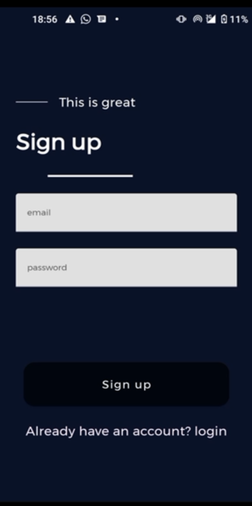
  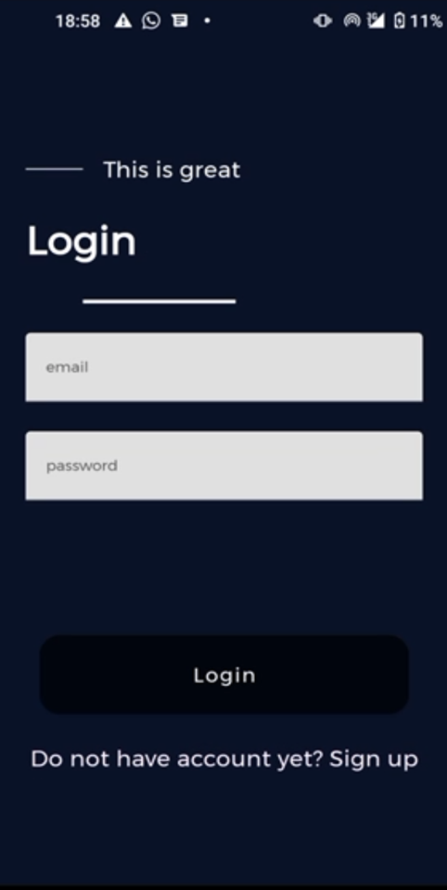
  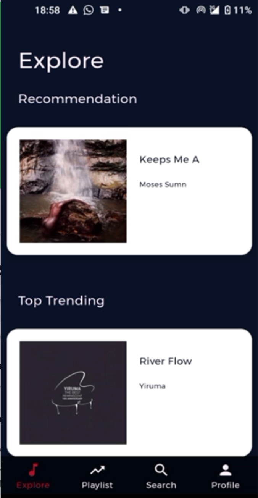
  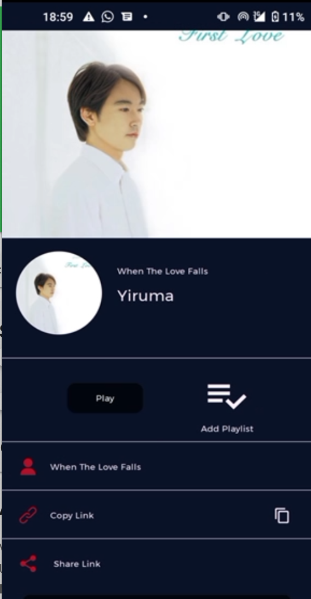


</p>

<p float="left">
    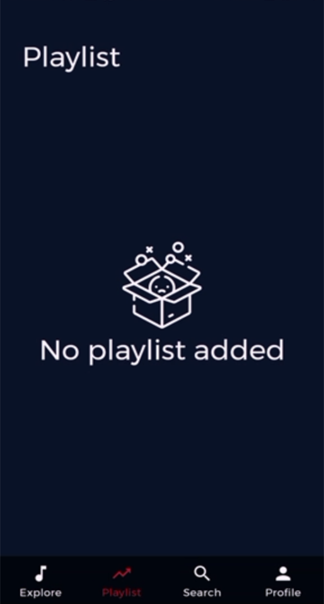
  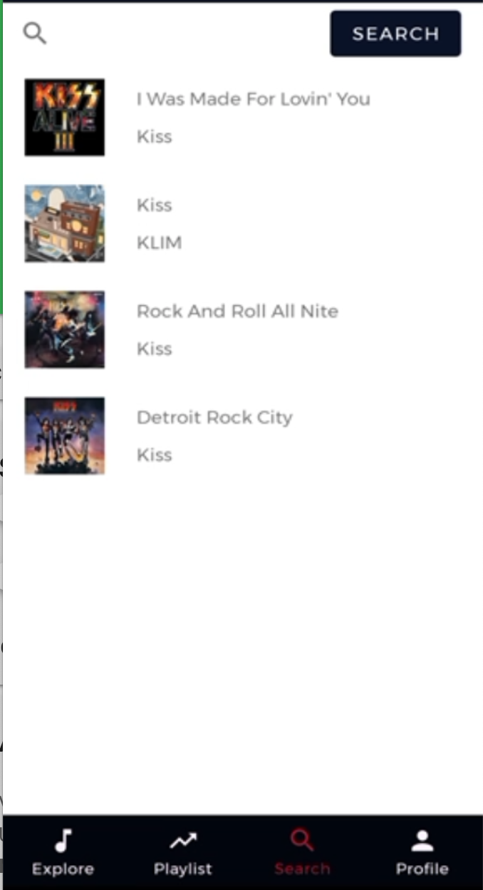
  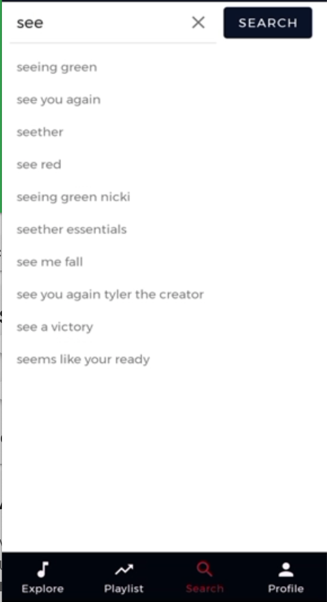
  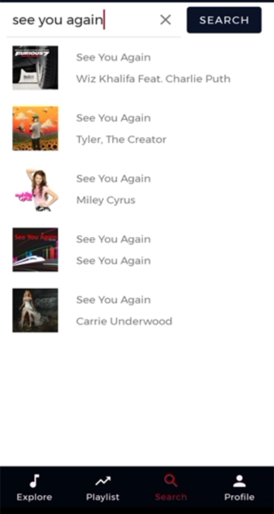

</p>


<p float="left">
  
   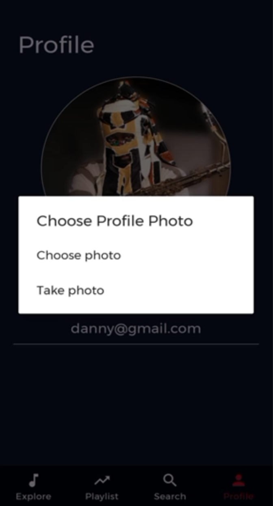
  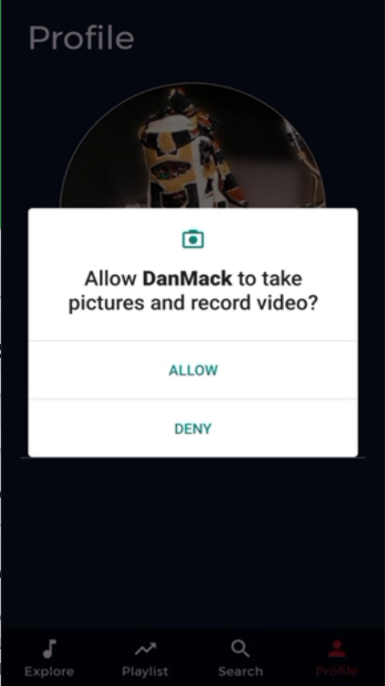
  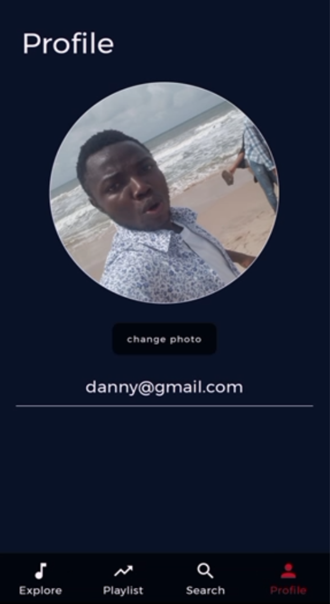
</p>

# Author
**Daniel Ayodeji**

# Code Of Coduct
Kindly take some time to go through the app code of coduct to help in healthy contribution to this project - see : [Code of Conduct](CODE_OF_CONDUCT.md)

# License
This project is licensed under the Apache License 2.0 - see : [licence](LICENSE)


